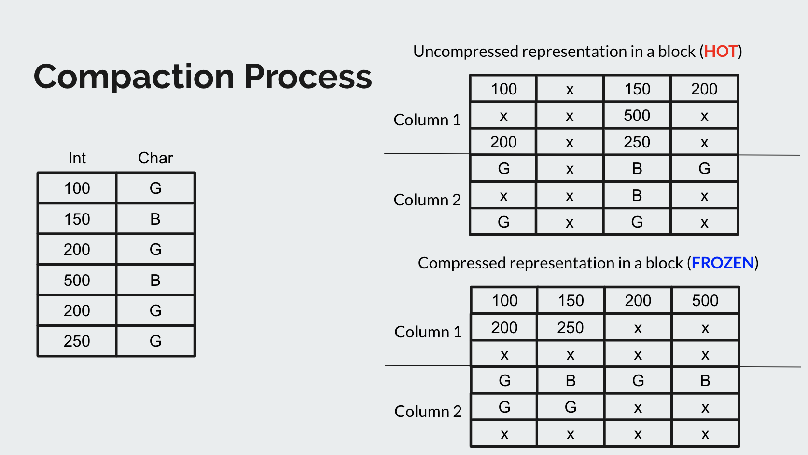
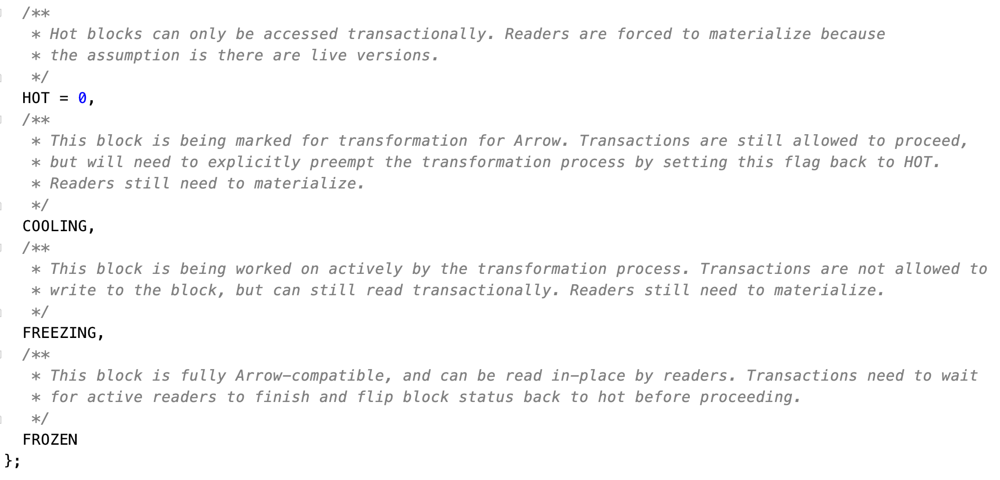
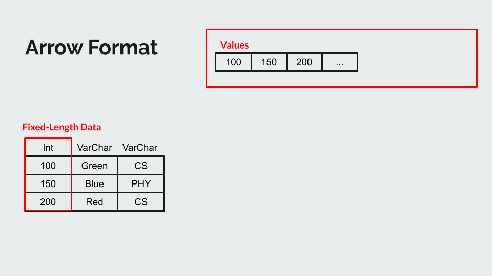
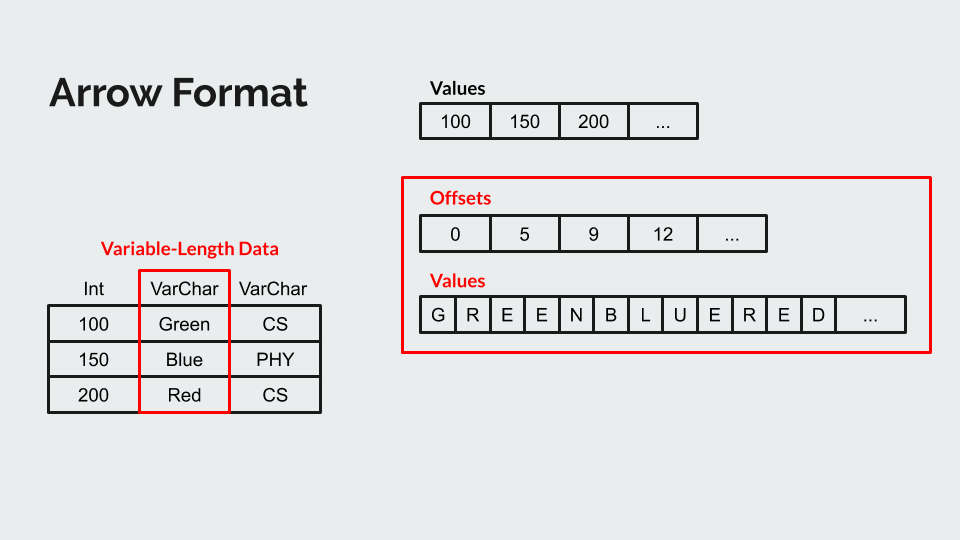
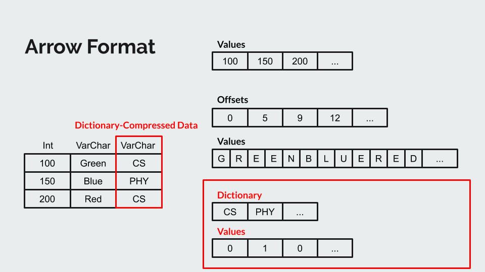
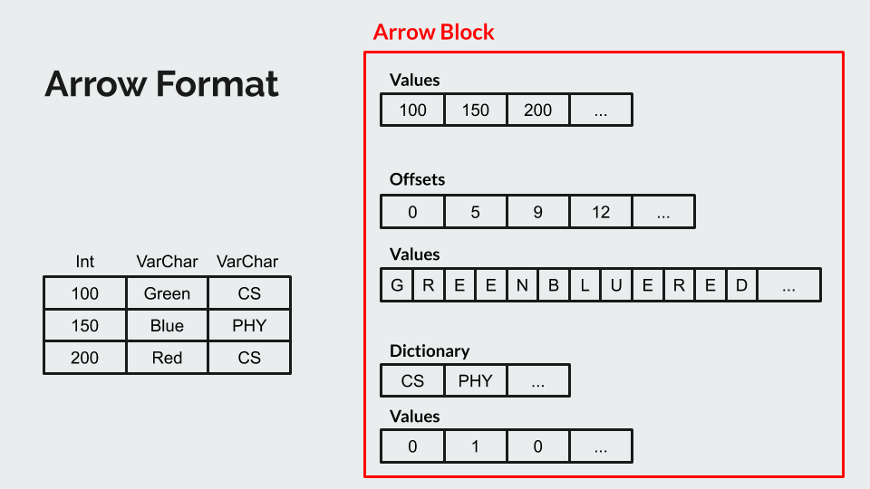

# Arrow Compression

## Overview
The arrow format stores column attributes in contiguous, aligned memory addresses. In contrast to delta-chain version storage, no pointers are allowed. Because of this, Arrow compression increases the performance of reading (scanning) tuples in a block with the trade-off of increasing the cost of writing (inserting, updating, deleting) tuples in that block. To maximize the benefit of arrow compression while minimizing its cost, block compaction (the process of taking blocks that are not in arrow format and manipulating them so that they are in arrow format) targets blocks that are not as likely to be written to. Block compaction moves tuples so that they are contiguous in memory and then stores each tuple attribute in the arrow format, thereby decreasing the amount of memory used in two ways. While the arrow format and block compaction are currently implemented in the system, their use is not. The 75%, 100%, and 125% goals of our component are: to add index updates to the block compaction process, to support the ability of the execution engine to operate on compressed data, and to provide a compaction policy (when block compaction should occur and on what blocks) that allows arrow compression to fully benefit the system.

## Scope
This feature relies upon the following files (.h/.cpp is left out for convenience):
 - storage_defs: defines tuple slot, block, etc.
 - arrow_block_metadata: defines arrow ‘metadata’ (format) of arrow blocks.
 - tuple_access_strategy: determines tuple access in a data table block based on block format (arrow or not arrow).
 - block_access_controller: determines reader/writer access to block based on block status (hot/cooling/cold/frozen).
 - block_compactor: implements block compaction logic to make data contiguous.
 - access_observer: adds blocks to a compaction queue (part of garbage collection).

This feature modifies the following files (.h/.cpp is left out for convenience):
 * data_table: Added AllocateSlot for testing TPL code written. CompactionInsertInto functionality added to reallocate the slot if necessary and insert data into a specific slot.
 * storage_interface: Added TableCompactionCopyTupleSlot to copy contents from one tuple slot to another during compaction.
 * The chain of files that need to be modified in order to add a built-in that can be utilized by the Terrier Processing Language (TPL) are as follows:
    * builtins.h: state the internal name and the built-in function name
    
    * sema_builtin.cpp: add the new built-in as one of the cases for which CheckBuiltinCall should call a more specific appropriate function, and specify in the more specific appropriate function the conditions that the call to the built-in must satisfy (number of arguments, types of arguments and return type)
 
    * vm.cpp: define the operation (OP) that matches the built-in; this operation reads register values to define the arguments in order, then calls the bytecode_handlers 'Op' for the built-in with those arguments and jumps to the next instruction with DISPATCH_NEXT()
    
    * bytecode_generator.cpp: define what generates/emits the bytecode; defines local variables and then calls Emit on the bytecode of the built-in
 
    * bytecodes.h: define the built-in's bytecode with the operand types of its arguments
 
    * bytecode_handlers.h and bytecode_handlers.cpp: define the built-in's OP, which is like a wrapper that call the lower-level function (e.g. from the storage interface) with its arguments
 
 * block_compactor: MoveTupleTPL function added to move contents from one slot to another using the execution engine rather than the storage layer.
 
 Tests
 * compaction-insert-into.tpl : A sample test added for the tpl code written.
 * block_compactor_tpl_test.cpp : Tests the MoveTupleTpl functionality in block_compactor

## Architectural Design
Arrow compression takes a HOT block as input with tuples not necessarily stored in contiguous memory locations. This HOT block is then added to a queue for compaction by the Garbage collector. The `block_compactor` then compacts the blocks in the queue into the arrow format for future reads. These arrow compressed blocks not only have all tuples stored in contiguous locations but also have dictionary compression enabled.

Blocks in this whole process can be in one of four states (HOT, COOLING, FREEZING, FROZEN). The details of these states is given below.

### The different processes that power our component are as follows:

#### Shuffle data within a block for compaction: 
When a single block is to be compacted, we need to shuffle the TupleSlots within each block by eliminating the gaps between individual TupleSlots in a block and move them all to the beginning of a block. To implement this, we delete all TupleSlots from the block to be compacted and then insert them back in into the same block (or create a new block, depending on our future design). This requires us to add the functionality of insert by specifying the block to which the block is to be inserted in. 

Going forward, we also need to add execution engine builtins to support these operations and also analyze whether bulk insertion will help us improve performance by avoiding locking overhead. 

#### Using the DB executors within block compactor: 
The current version of block compactor directly operates on the data table and does not update the table indexes. Hence, we need to modify the block compactor to invoke the insert and delete executors from the execution engine. 

#### Background thread for compaction process: 
When a certain number of GC epochs have passed since the last time that a file was modified, the thread that performs the garbage collection also marks a block for compaction. Currently, there is no background thread running that checks the status of blocks and performs the compaction logic. We are yet to figure out how this component is to be fitted into the system. 

## Design Rationale
We have designed the different processes to enable the arrow compaction scheme with three considerations in mind
- Ensuring the database consistency is maintained
- To have the compaction scheme operate seamlessly in the background 
- Avoid high overhead due to the compaction scheme. 

We ensure that the database consistency is maintained by updating indexes along with the table entries together through the invocation of the database executors and handling conflicts during the compaction process. The compaction process will be designed to run separately in a background thread to minimize the effect on user transaction. The high overhead due to the compaction scheme is taken into consideration by allowing readers to access the data over a large fraction i.e., even during the compaction process and by having the compaction process convert the block state back to HOT without trying to compact or compress the block. 

## Testing Plan
First, we would like to establish the baseline performance for OLAP queries by running a standard OLAP workload like TPC-H on terrier. With this information in hand, we can measure the speedup that our implementation provides for OLAP queries.

We would then enable the compaction process, verify the correctness of the arrow format blocks and then run the same OLAP queries on these compressed blocks. At this stage, the reader will still be materializing the tuples to be read and so we do not expect any performance improvements here. 

Our final testing step would be to run the same OLAP queries directly on the compressed data without materializing tuples to be read. We expect a significant performance improvement here because there is no overhead of materialising tuples and also that tuples within a block are present in contiguous memory locations. 

If we get to the 125% project goal (designing policy for marking a block for conversion), we can also run rigorous tests with different policies on hybrid workloads. This way, we can determine the best policy for marking a block for compaction.

## Trade-offs and Potential Problems
Trade-offs:
- The block compactor is currently designed to shuffle tuples among the blocks without allocating any new blocks. Allocating new blocks and moving the tuples to the new blocks fits better with the design of the data table where updates occur as deletes followed by insertions. However, it results in more memory usage, especially if block compaction is occurring frequently. In addition, if new blocks are added to the end of the data table, they may be more likely to have new tuples inserted into them than they would otherwise and cause the block compactor to run more often.

- In the block compaction process itself, there is a constant question of how many blocks could or should be compacted at a time and the scale of the other operations. For example, how many tuples should be inserted into the table at once: a bulk insert into multiple blocks, a bulk insert into a block, or a single insert into a block (the current design). This affects the performance and overhead of the bulk compaction process as appropriate-sized groupings for an operation can speed up block compaction while inappropriate - too small or too big - groups can make the block compaction process not impactful or cumbersome respectively. The appropriate sizes have not been determined.

- Though we have not determined what approach to use to make the execution engine aware of the dictionary of a particular block, we foresee that there will be a trade-off between the cost of decompressing and materializing a tuple at the storage layer and the cost of “passing up” the dictionary or making it accessible to the execution engine. Our hope is that the cost of the latter will be less, which we will aim for in our design.

Potential Problems:
- A block compaction group (the blocks that are going to be compacted together) is currently implemented as only having one block, although in actuality each block compaction group could and should have more than one block. The logic to compact multiple blocks is implemented, but is not being used. This is a problem because compacting multiple blocks introduces additional considerations and design options for our modifications. For instance, the states (hot, cooling, freezing, frozen) are on a per-block basis and part of the compaction process is done in the cooling stage and part of the compaction process is done in the freezing stage. In the cooling stage, writers can insert into the block and its state is changed to the hot, but in the freezing stage writers cannot insert into the block. Currently a block’s change of state (specifically from cooling to hot) causes the compaction process to stop and roll back. It is difficult to identify and validate the full impact of a block’s change of state on the compaction process when multiple blocks are involved.

- Each block has its own arrow dictionary. If tuples and tuple attributes are not being materialized (the primary advantage of compression), this means that there must be a way to compare non-compressed expressions with compressed data. To do this, the execution engine needs to be aware of a dictionary that is dependent upon a tuple’s location. This means it needs to know which dictionary is being used (by knowing which block the compressed data came from) and have access to that dictionary. The execution engine also needs to have context as to whether the data it is being given is compressed or not compressed. A data table will have both types of data, each in arrow or non-arrow blocks respectively. These are problems because it is not currently clear as to where or how such changes could be made in a way that would fit the design of the execution engine.

- The block compactor was designed with the assumption that memcpy is atomic, but in actuality memcpy is not atomic. [See https://github.com/cmu-db/terrier/issues/402]. This is a problem because there may be a race in the block compaction process.

## Current Status
* TPL built-ins for the following use cases:
    * To copy a tuple from one location to another
    * To insert into a specific TupleSlot
    * To allocate a new TupleSlot 
* New test in `sample_tpl/` that demonstrates the working of the newly created built-ins which inserts into a specific slot along with index updates.
* Added a new test file: `block_compactor_tpl_test.cpp` to verify the working of the newly added TPL built-in.
The original behaviour of `BlockCompactor` is retained, and we added a new function, `MoveTupleTPL` to demonstrate the working of the newly added TPL built-ins. For now, we have used hard-coded TPL code inside the `BlockCompactor`, this needs to be changed to generate code via `CodeGen` once the dependency issue is resolved. As mentioned in Future Work, it should be redesigned to prevent the circular dependency to `catalog` so that an execution context can be constructed from within the `BlockCompactor`.

## Future Work
Currently we are working on our 75% goal which is to enable compression of blocks through the execution layer (updates tables as well as indexes). We are yet to start working on the execution layer but we think we will have to write TPL code which will be called as a builtin from the `block_compactor` code. 

For our 100% goal, we will be running OLAP queries directly on top of the compressed data and so, we will have to add functionality for reading FROZEN blocks directly rather than materializing them. 

For the 125% goal we have to experiment with the different policies for starting the cooling process. This would involve changes to the policy in the garbage collector code.

## Arrow Format
The official specification of the Arrow Format can be found at https://arrow.apache.org/docs/format/Columnar.html.
The following are illustrations of the data formats that are currently supported by Terrier:

